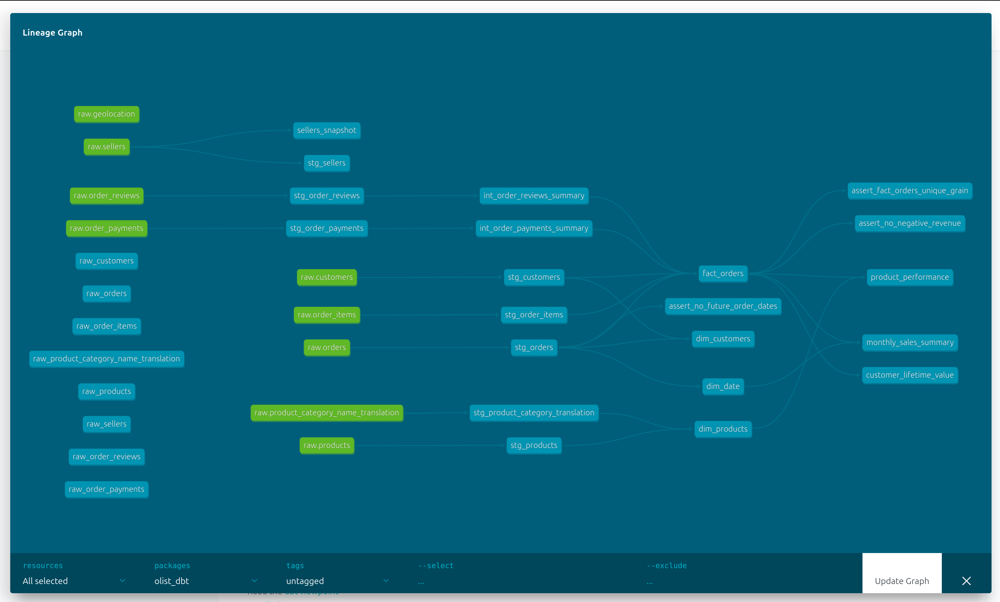

# Olist Analytics Engineering Pipeline

An end-to-end analytics engineering project that transforms raw Brazilian e-commerce data into a tested, documented dimensional model built with dbt, PostgreSQL, and Docker, with automated CI on every push.

---

## The Problem

The Olist dataset arrives as nine disconnected CSV files. Column names are inconsistent, types are untyped strings, and one column in the source data is even misspelled (`product_name_lenght`). Answering a question as ordinary as *"what was revenue by product category in São Paulo last quarter?"* means joining four or five tables by hand and getting the joins subtly wrong is easy enough that two analysts can produce two different numbers from the same data.

This project builds a layered transformation pipeline that does that work once, tests it automatically, and documents every assumption.

---

## Architecture

```
CSV files (Kaggle)
      │ load_data.py  (Python + SQLAlchemy)
      ▼
  schema: raw               ← untouched copy of the source, the source of truth
      │ dbt source()
      ▼
  schema: staging           ← renames, type casts. No joins, no aggregation.
      │ dbt ref()
      ▼
  schema: intermediate      ← collapses finer-grained tables to one row per order
      │ dbt ref()
      ▼
  schema: marts             ← star schema + pre-aggregated business tables
```

| Layer | Responsibility | Materialization | Models |
|---|---|---|---|
| `raw` | Verbatim copy of source CSVs | table (outside dbt) | 9 tables |
| `staging` | Clean column names, cast types | view | 8 |
| `intermediate` | Reshape grain so joins are safe | view | 2 |
| `marts` | Star schema and business metrics | table | 7 |

Each layer has exactly one job. Staging never joins; intermediate never aggregates for business consumption; marts never reads from staging directly. Keeping these boundaries strict is what makes a broken number traceable to a single layer.

---

## Data Model

`fact_orders` sits at the centre with a grain of **one row per order item** (112,650 rows), surrounded by conformed dimensions.

```
    dim_customers                dim_products
     (96,096)                     (32,951)
          ╲                         ╱
           ╲                       ╱
            ──── fact_orders ─────
                 (112,650)
                      │
                  dim_date
                   (800)
```



*Full lineage from the nine raw sources through staging, intermediate, and marts — generated by `dbt docs generate`.*

**Why item-level grain?** Aggregation can always go up, never down. From item level you can roll up to per-order totals whenever you need them; from order level, the information about *which* product and *which* seller was involved is gone for good.

**Additive vs non-additive measures.** `price`, `freight_value`, and `item_revenue` live at the fact's own grain and are safe to `SUM`. `order_total_payment_value` and `review_score` are order-level attributes repeated across every item of a multi-item order — filter and group by them freely, but summing them double-counts. This is documented on the model itself so downstream consumers can't miss it.

**Why two intermediate models?** `order_payments` and `order_reviews` can both hold several rows per order. Joining either one straight onto the fact would fan out each item row into several, quietly inflating every revenue figure. `int_order_payments_summary` aggregates payments down to one row per order; `int_order_reviews_summary` keeps only the most recent review. Both carry a `unique` test on `order_id` — that test is what proves the collapse actually worked.

### Business marts

| Model | Grain | Answers |
|---|---|---|
| `customer_lifetime_value` | one person | spend, order count, average order value |
| `monthly_sales_summary` | one month | revenue and volume over time |
| `product_performance` | one product | units sold, revenue, mean review score |

All three read from `fact_orders` rather than from staging, so a change to the revenue definition propagates everywhere instead of leaving three reports to drift apart.

---

## Tech Stack

- **PostgreSQL 15** (Docker Compose) — warehouse
- **dbt-core 1.12** with `dbt-postgres` — transformation, testing, documentation
- **dbt_utils** — multi-column uniqueness tests
- **Python** (pandas, SQLAlchemy) — initial CSV load and CI seed generation
- **GitHub Actions** — CI on every push

---

## Getting Started

```bash
# 1. Clone
git clone https://github.com/Talithashakira/oltp_dbt_analytics.git
cd oltp_dbt_analytics

# 2. Python environment
python3 -m venv .venv
source .venv/bin/activate
pip install -r requirements.txt

# 3. Download the dataset
# https://www.kaggle.com/datasets/olistbr/brazilian-ecommerce
# Extract all nine CSVs into data_raw/

# 4. Start Postgres
docker compose up -d

# 5. Load raw data
python scripts/load_data.py

# 6. Configure dbt (kept outside the repo so credentials are never committed)
mkdir -p ~/.dbt
cp olist_dbt/profiles.yml.example ~/.dbt/profiles.yml

# 7. Build and test
cd olist_dbt
dbt debug
dbt deps
dbt run
dbt snapshot
dbt test
```

To browse the model documentation and lineage graph:

```bash
dbt docs generate
dbt docs serve
```

---

## Testing

86 automated tests run on every build:

- **`unique` / `not_null`** on every primary key and every measure
- **`relationships`** validating foreign keys — Postgres has no FK constraints here, so orphan records would otherwise pass unnoticed
- **`accepted_values`** on categorical columns (`order_status`, `payment_type`, `review_score`, `quarter`)
- **`dbt_utils.unique_combination_of_columns`** where the key is composite: `order_id + order_item_id`, `order_id + payment_sequential`
- **Custom singular tests** for business rules: no future order dates, no negative revenue, and a direct assertion that `fact_orders` holds its stated grain

The same column can need a different test in a different model. `order_id` is a primary key in `stg_orders` and gets `unique`; in `stg_order_items` it's a foreign key that repeats by design, so it gets `not_null` only. The test follows the column's role in that model, not its name.

---

## CI/CD

Every push to `main` triggers a GitHub Actions workflow that spins up a clean Postgres service container, loads sampled seed data, and runs the full pipeline:

```
dbt deps → dbt seed → dbt run → dbt snapshot → dbt test
```

The CI database starts empty, and the Olist CSVs are too large to commit. `scripts/make_seeds.py` therefore extracts a **relationally consistent sample** — 500 orders, plus only the items, payments, reviews, customers, products and sellers belonging to those orders. A naive random sample would break every `relationships` test, since sampled child rows would point at parent rows that weren't sampled.

`sources.yml` uses `identifier` and `var()` so the same model code reads from `raw.orders` locally and from the seeded `dbt_ci_seed.raw_orders` in CI, with nothing in the SQL changing between environments.

---

## Data Quality Findings

Exploration surfaced several things worth knowing before trusting any number from this data:

**Repeat purchase is rare.** 99,441 orders come from 96,096 distinct people — roughly 3% of orders are repeat business.

**`customer_unique_id` is not unique.** The Olist `customers` table is a per-order snapshot of a shipping address, not a customer registry. A new `customer_id` is minted for every order; `customer_unique_id` is the stable person identifier and therefore repeats. The column whose name contains "unique" is the one that isn't. `dim_customers` deduplicates to one row per person, taking the address from that person's most recent order.

**775 orders have no order items.** 603 are `unavailable` and 164 are `canceled` — orders that failed before any line item was recorded. That accounts for the 676-row gap between `dim_customers` (96,096) and `customer_lifetime_value` (95,420): those are people whose every order fell into this bucket, so they never reach the fact table.

**Eight of those orders are anomalies.** Five `created`, two `invoiced`, and one `shipped` — an order marked as shipped with no record of what was in it. A small count, but not something the data model can explain away.

**The catalogue has no dead stock.** All 32,951 products in `dim_products` appear in `product_performance`, meaning every product sold at least once.

---

## Design Decisions and Limitations

These are choices, not oversights, and they're stated here so nobody has to reverse-engineer them from the SQL:

- **Revenue includes freight.** `item_revenue = price + freight_value`. Both columns are kept separately in the fact table, so a goods-only figure is always one query away.
- **Cancelled orders are included.** `customer_lifetime_value`, `monthly_sales_summary`, and `product_performance` count orders of every status, so their revenue is gross of cancellations. Filtering on `order_status` is left to the consumer.
- **Reviews keep only the latest.** When an order has several reviews, `int_order_reviews_summary` keeps the most recent and discards the rest. This protects the fact table's grain but means review revisions can't be analysed.
- **`avg_review_score` in `product_performance` is unit-weighted.** A product bought three times in one order counts that order's review three times.
- **No `dim_sellers` yet.** `seller_id` is present in the fact table and `stg_sellers` is ready, but the dimension hasn't been built — so seller-side analysis isn't possible from the marts layer today.
- **The snapshot demonstrates rather than tracks.** `sellers_snapshot` implements SCD Type 2 over seller location attributes, but the Olist dataset is static, so no history will accumulate on its own.

---

## Next Steps

- Build `dim_sellers` to open up seller-side analysis
- Add source freshness checks
- Add `exposures` to document which dashboards depend on which models
